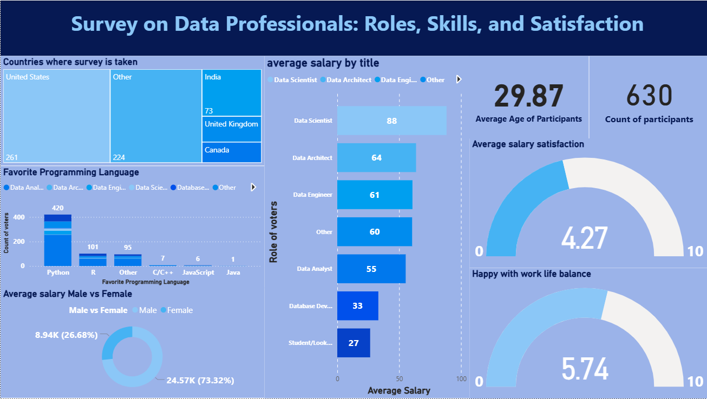

# 📊 Survey on Data Professionals: Roles, Skills, and Satisfaction

A Power BI dashboard analyzing survey data from 630 global data professionals. It presents insights on job roles, programming language preferences, salaries, gender-based pay gaps, and workplace satisfaction.

---

## 📌 Overview

This project explores:
- Most common job titles in data-related fields
- Preferred programming languages
- Salary differences by role and gender
- Career satisfaction and work-life balance

---

## 📈 Dashboard Features

- 🌍 **Countries of Respondents**  
  Tree map showing participant distribution by country.

- 💼 **Average Salary by Job Title**  
  Bar chart comparing salaries across roles like Data Scientist, Data Engineer, and Analyst.

- 🧠 **Favorite Programming Languages**  
  Bar chart showing vote count for languages like Python, R, SQL, etc.

- 👨‍👩‍👧 **Gender-Based Salary Comparison**  
  Donut chart showing male vs. female average salaries.

- 📊 **Key Metrics**
  - Total participants: `630`
  - Average age: `29.87`
  - Salary satisfaction: `4.27 / 10`
  - Work-life balance: `5.74 / 10`

---

## 📷 Screenshots

---

## 🛠️ Tools Used

- Microsoft Power BI  
- Microsoft Excel  
- DAX (Data Analysis Expressions)

---

## 📂 Files Included

- `dashboard.pbix` – Power BI file  
- `survey_data.xlsx` – Cleaned in Power BI (uncleaned)  
- `README.md` – Project documentation

---

## 🚀 How to View the Dashboard

1. Clone this repository or download the files.
2. Open `dashboard.pbix` in Power BI Desktop.
3. Explore the interactive visuals.

---

## 🧠 Learning Outcomes

- Data modeling and transformation in Power BI  
- Building insightful visual dashboards  
- Designing clear, interactive reports  
- Applying DAX for custom KPIs and measures

---
## 🧾 Author

**Shaik Roshan Basha**  
[LinkedIn](https://www.linkedin.com/in/roshan-shaik0337/) | [Email](mailto:roshanshaik378@gmail.com)

---
